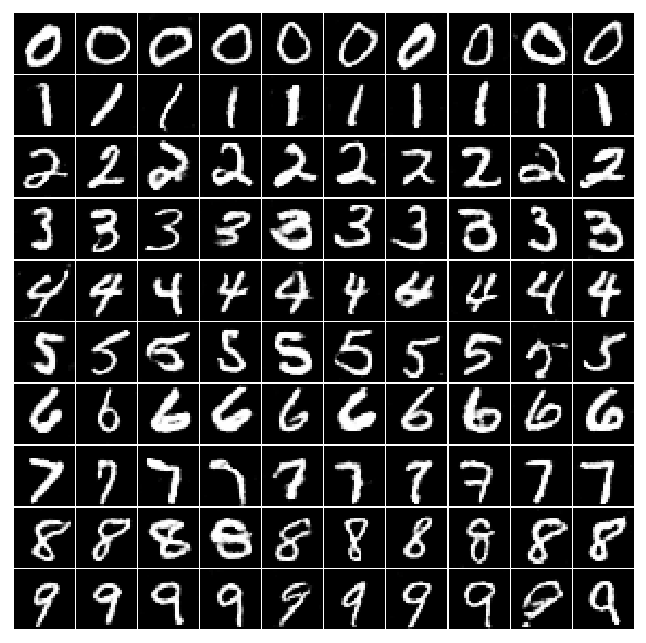

# CGAN in TensorFlow

This is a TensorFlow implementation of a Conditional Generative Adversarial Network (CGAN) applied on the simple task of generating specific handwritten digits. For more information check out my blog article about CGANs https://cfml.se/blog/cgans/.
